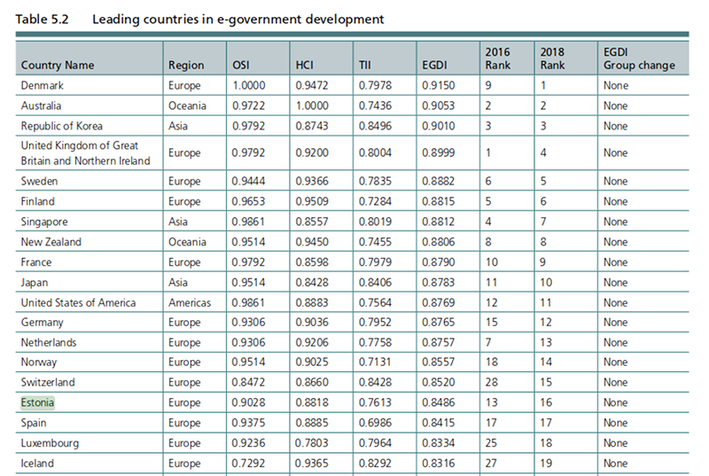
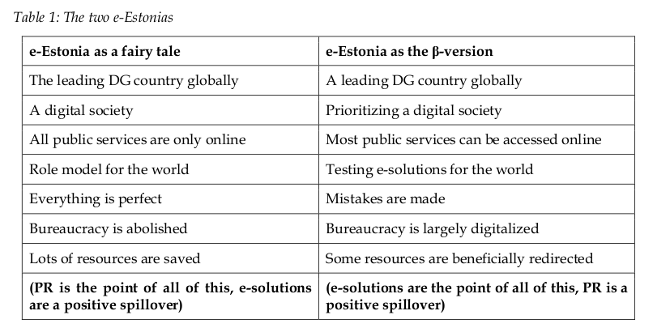
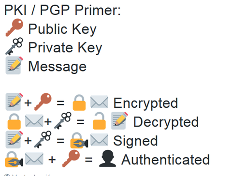
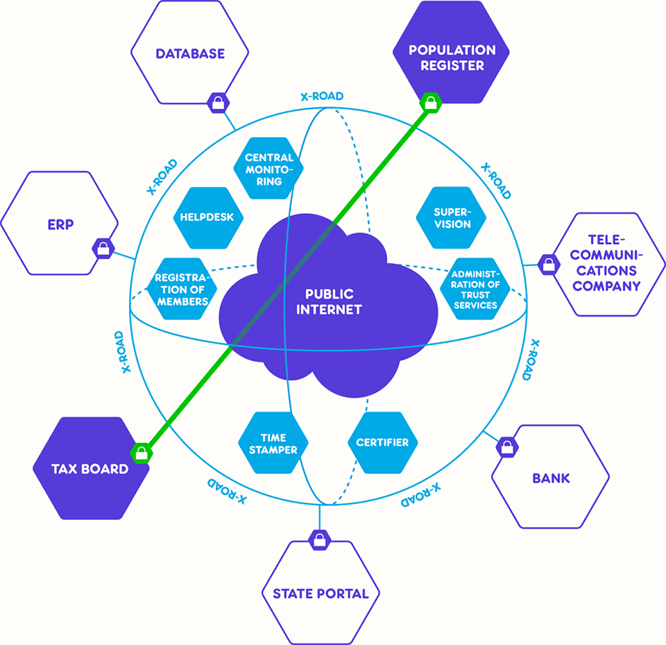

title: Estònia, Estat digital: Realitat o ficció?
class: animation-fade
layout: true

<!-- This slide will serve as the base layout for all your slides -->
.bottom-bar[
  {{title}}
]

---

class: impact
background-image: url(front.png)

# Estònia, Estat digital:

## Realitat o ficció?

---

# Tere, mina olen Dario Castañé.

- Enginyer informàtic
- Pirata (polític)
- Regidor
- Divulgador

???

- /'mina o'lan/
- De professió, informàtic
- Actiu políticament des del 2010
- Regidor a Igualada des del 2015
- I de la unió d'aquests interessos, descobrint Estònia des del 2014
- Vinc a explicar-vos en què consisteix l'estat digital d'Estònia

---

# Pathfinder: e-Estonia as the beta version

- Wolfgang Drechsler (Tallin University of Technology)
- Publicat al Journal of eDemocracy sota llicència Creative Commons

???

- Dit això, la xerrada es divideix en tres parts:
- Context social i polític
- Explicació de les principals peces de la infraestructura a grans trets
- Conclusió i aplicació a Catalunya

---

background-image: url(estonia.png)

# Estònia

- Nord d'Europa
- 1,3 milions d'habitants
- 70% d'estonians
- Lliberals i conservadors

???

- Situació geogràfica: mar bàltic
- Exrepública soviètica (30% de la població és russa)
- És habitual en exrepúbliques soviètiques
- La majoria parlamentària és una suma lliberal i conservadora

---

# Més context

- Més del 85% de la població té accés a Internet a casa
- Més del 75% en té al mòbil i en fa ús habitual
- Existeix la percepció que el govern no pot fer mal ús de les dades
- L'accés a Internet és un dret social

---

# Efemèrides importants

- 1991: independència de l'URSS
- 1995: inici dels projectes d'e-Gov i Tiigrihüpe
- 2000: primer consell de ministres sense papers
- 2001: posada en marxa d'X-Road
- 2005: primeres eleccions amb e-Voting
- 2007: atacs ciberterroristes
- 2014: llançament d'e-Residency

???

- tiigrihüpe: tiigrijiupe (salt del tigre), programa d'alfabetisme digital
- Hostatgen el Centre d'Excel·lència de Cooperació en Ciber Defensa de l'OTAN

---

# Realitat o ficció?

- “On podem trobar el govern electrònic més avançat del món? Estònia” (Keen, 2018)
- “Lliçons del país més avançat digitalment del món” (High, 2018a)
- “Estònia ha transformat el govern en un lloc web. Altres països proven d'atrapar-lo. Estònia és una utopia tecnològica” (Matthews, 2018)
- Estònia, la República Digital. El seu govern és virtual, sense fronteres, sobre blockchain i segur”
(Heller, 2017)

???

- Consultar la sala

---

# Ficció...

.center[]

???

- [United Nations e-Government Survey 2018](https://publicadministration.un.org/egovkb/Portals/egovkb/Documents/un/2018-Survey/E-Government%20Survey%202018_FINAL%20for%20web.pdf)
- El problema d'Estònia és que està "inflant" els seus esforços reforçant el marc mental de tot allò tecnològic i innovador és necessàriament positiu
- “All the policy makers and legislators with whom I spoke have, in the best Silicon Valley fashion, drunk the Kool-Aid [...] But the truth is less triumphant. The revolution remains a work in progress, and many ordinary Estonians remain indifferent“ (2018)
- Però, en el fons, tots sabem que per molts iPhones que llencis a la població, no necessàriament la democràcia serà millor
- Tots tenim major accés a la informació que mai però les fake news se'ns mengen
- PD: no hi ha blockchain!

---

# ... amb una mica de realitat

- Administració simplificada (.em[però tampoc és perfecta!])
- Només casar-se, divorciar-se o vendre béns immobles no es poden fer en línia
- Inverteixen en continuar millorant
    - Sobretot en seguretat

???

- 90% of Estonian DG propaganda as hype and 10% as true; or 50% reality and 50% “you know, not lies, but the kind of stuff government people just say.”
- Tot i que l'administració pública és més simple, no vol dir que hi hagi menys burocràcia o menys gent treballant per l'Estat
- Imperfecció (2016): 925 bases de dades, un 20% registrat, gran duplicitat de dades i sense integrar
- Menys paperassa, menys temps d'espera, etc
- I l'èmfasi en la seguretat és per Rússia, percebuda com una amenaça
- Estònia cerca obrir camí i això ho fa molt bé. L'hem d'entendre com una "beta permanent"

---

# e-Nàrnia contra e-Estònia en beta

.center[]

???

- Repàs de la taula i...
- Passem a la següent part de la xerrada

---

# Com funciona?

- eID: identitat digital
- X-Road: capa d'intercanvi de dades
- KSI: blockchain per a integritat de dades
- IVXV: vot electrònic
- e-Residency

???

- Tots aquests serveis estan a Github
- Hi ha més però aquests tres són els principals
- e-Residency és un servei per a forans

---

# eID

- Sistema d'identitat basat en infraestructura de clau pública (PKI)
  - github.com/open-eid
- PGP: Phil Zimmermann, 1991
- Primera legislació: 1999

???

- Certificat DNI electrònic, IDcat
- Digidoc: C++
- Altres: Java

---

## Criptografia asimètrica (molt resumida)

- Clau pública: xifrar
- Clau privada: signar

.right[]

???

- Criptomonedes
- HTTPS: candau verd

---

# X-Road

- Capa d'intercanvi de dades
- Es crea i llença el 2001
- S'allibera el codi font el 2016:
    - github.com/nordic-institute/X-Road
- Finlàndia i Estònia connecten les seves xarxes el 2017

???

- Capa d'intercanvi de dades
- Exemples: dentistes, metges, etc
- Participació:
  - \>650 institucions i empreses
  - \>2600 serveis
  - \>900 milions de transaccions

---

.center[]

???

- Les comunicacions són descentralitzades
- Propietat de les dades: Controls d'accés i privacitat per disseny
- Tots els missatges poden ser emprats com evidència digital (eIDAS)
- eIDAS: reglament europeu d'identitat electrònica
- Estàndar: Java + SOAP
- Servidor central: "DNS" + registres de confiança (temps i certificats)
- Servidor de seguretat: intermediari segur entre sistemes d'informació (multi-tenant)
- Sistema d'informació: nodes de dades (peers)
- Autoritats: segell de temps i certificació

---

# KSI

- Blockchain per a integritat de dades
- Keyless Signature Infrastructure
  - github.com/guardtime/libksi
- 2003: segellat de temps encadenat

???

- Guardtime KSI
- Buldas and Saarepera from Guardtime were the first cryptographers to give a formal security proof in 2003.

---

background-image: url(blockchain.png)

---

# IVXV

- Sistema de vot (segona iteració)
  - github.com/vvk-ehk/ivxv
- Primera legislació: 2002
- Primeres eleccions: 2005
- Cobreix tot el procés

???

- Tecnologia: Java + Go
- Parts:
  - Auditor: valida operacions d'altres eines
  - Processador: recompte i validació de butlletes off-line
  - Clau: servei de generació de claus privades i desxifrat de butlletes 
  - Interfície
- No permet fer vot nul, tret que tinguis coneixements per manipular l'aplicació de votació (Piraadi)
- 30% de participació electrònica (2014-2017)

---

# e-Residency

- Accés a serveis:
  - Creació d'empreses
  - Obertura de comptes bancaris
  - Taxes
  - ...

???

- La infraestructura més popular pel seu impacte global
- Extensió de l'administració electrònica sense fronteres
- Requereix un procés de validació i recollida física

---

background-image: url(e-residency.jpg)

---

# És possible a Catalunya?

- Sí
- Cal esperar a la Generalitat? No necessàriament
- Hi ha molta feina per fer!

???

- Un factor important és la mida del país
- Les eines hi són
- Llençar proposta de creació de projecte per resoldre reptes pendents:
  - Confiança: blockchain?
  - Descentralització
  - Resiliència
  - Seguretat
  - RGPD

---

# Aitäh! APM?

- i@dario.im
- github.com/imdario
- @dario@mastodon.social
- @im_dario
- keybase.io/dario
